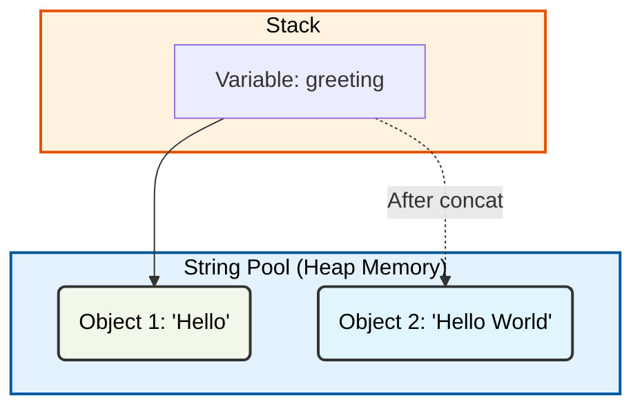
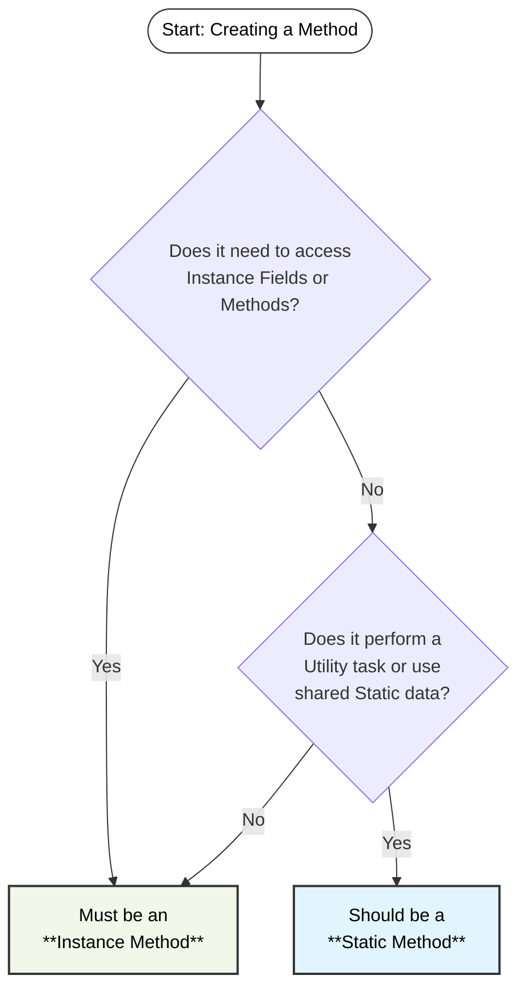

# Java Fundamentals Part 2

## Table of Contents

- [1) Variable Scope](#1-variable-scope)
- [2) Method Overloading](#2-method-overloading)
- [3) Strings](#3-strings)
- [4) StringBuilder](#4-stringbuilder)
- [5) Date & Time API](#5-date--time-api)
- [6) Static vs Instance](#6-static-vs-instance)

## 1) Variable Scope

**Scope** defines the visibility and accessibility of a variable within a program. In Java, where you declare a variable
determines its scope.

### 1. Class-Level Scope (Fields)

Variables declared inside a class but outside any method. They are accessible by any method within the class.

- **Instance Variables**: Belong to an object.
- **Static Variables**: Belong to the class itself.

### 2. Method-Level Scope (Local Variables)

Variables declared inside a method. They are only accessible within that specific method and cease to exist once the
method finishes execution.

### 3. Block-Level Scope

Variables declared inside a specific block of code, such as `if` statements or `loops` (for, while). They are only
accessible within the curly braces `{}` where they were defined.

### Example:

```java
public class ScopeDemo {
    // 1. Class-Level Scope (Field)
    int classVariable = 10;

    void myMethod(int parameter) {
        // 2. Method-Level Scope (Local Variable)
        int methodVariable = 20;

        if (methodVariable > 10) {
            // 3. Block-Level Scope
            int blockVariable = 30;
            System.out.println(blockVariable); // OK
        }
        // System.out.println(blockVariable); // ERROR: Out of scope
    }
}
```

---

## 2) Method Overloading

Method Overloading is a feature in Java that allows a class to have more than one method with the same name, as long as
their parameter lists are different. It is a way to achieve Compile-Time Polymorphism.

### Key Rules:

- Methods **must** have the same name.
- Methods **must** have different parameters (different type, number, or both).
- Return type **can** be different, but changing the return type alone is not enough to overload a method.

### Why use Overloading?

It improves code readability by allowing descriptive method names without needing prefixes like `addInt`, `addDouble`,
etc.

### Examples:

#### 1. Overloading by Parameter Type

```java
public class MathOperations {
    // Add two integers
    public static int add(int a, int b) {
        return a + b;
    }

    // Overloaded: Add two doubles
    public static double add(double a, double b) {
        return a + b;
    }
}
```

#### 2. Overloading by Number of Parameters (Varargs)

The term **Varargs** is short for "variable-length arguments." It allows a method to accept zero or more arguments of a
specified type.

```java
public class MathOperations {
    // Overloaded: Add multiple integers using Varargs
    public static int add(int... numbers) {
        int sum = 0;
        for (int n : numbers) {
            sum += n;
        }
        return sum;
    }
}
```

#### 3. Example: Payment Processing

```java
public class PaymentProcessor {
    // Process Credit Card
    public static void processPayment(String cardNumber, String cvv, double amount) {
        System.out.println("Processing Card: " + cardNumber);
    }

    // Process Bank Transfer
    public static void processPayment(String bankAccount, String swift, double amount) {
        System.out.println("Processing Bank Transfer to: " + bankAccount);
    }
}
```

#### 4. Example: Notification Service

```java
public class NotificationService {
    // Send a simple notification
    public static void send(String message) {
        System.out.println("Sending Notification: " + message);
    }

    // Overloaded: Send a notification to a specific email
    public static void send(String message, String email) {
        System.out.println("Sending Email to " + email + ": " + message);
    }

    // Overloaded: Send a notification with a priority level
    public static void send(String message, int priority) {
        System.out.println("Priority [" + priority + "] Notification: " + message);
    }
}
```

---

## 3) Strings

The **String** class in Java is used to represent a sequence of characters. It is one of the most commonly used classes
and is part of the `java.lang` package.

### Key Characteristic: Immutability

Strings in Java are **immutable**, which means their content **cannot be changed** once they are created in memory.

#### Why are they immutable?

- **String Pool**: Java uses a special memory area called the "String Pool" within the **Heap Memory** to store strings.
  If two variables have the same value, they point to the same object in the pool to save memory.
- **Security**: Since strings are used for sensitive data like passwords, network connections, and file paths, their
  values must remain constant.
- **Thread Safety**: Multiple threads can safely share the same string object without worrying about changes.

#### Understanding Memory: Stack vs. String Pool

To understand how strings work, it's important to know about two memory areas:

1. **Stack Memory**: This is where **variables** (references) are stored. For example, the variable `greeting` itself
   lives on the stack.
2. **String Pool (Heap Memory)**: This is where the **actual string objects** (the values) are stored.

#### How it works (Visualization)

Any operation that seems to "modify" a string (like `concat()`, `toUpperCase()`, or `replace()`) actually creates a *
*new** string object in the String Pool, while the original remains unchanged. The variable on the stack is then updated
to point to the new object.

> **What happens to the original data?**  
> The original string object remains in the **String Pool**. If it is no longer referenced by any variable, it becomes
> eligible for **Garbage Collection**, meaning the JVM will eventually remove it from memory to free up space. However,
> if
> other variables still point to it, it stays exactly as it was.  
> *For more info, see: [Garbage Collection in Java](https://www.geeksforgeeks.org/garbage-collection-in-java/)*



```java
public class StringDemo {
    void main() {
        String greeting = "Hello";
        greeting.concat(" World"); // This creates a new string but doesn't change 'greeting'
        System.out.println(greeting); // Output: Hello (The original object is untouched)

        greeting = greeting.concat(" World"); // Re-assigning the variable to the new object
        System.out.println(greeting); // Output: Hello World****        
    }
}
```

### Common String Methods

| Method                            | Description                                                 |
|:----------------------------------|:------------------------------------------------------------|
| `length()`                        | Returns the number of characters.                           |
| `charAt(index)`                   | Returns the character at the specified index.               |
| `indexOf(...)`                    | Returns the index of a character or substring (Overloaded). |
| `substring(...)`                  | Extracts a portion of the string (Overloaded).              |
| `equals(other)`                   | Compares content for equality (case-sensitive).             |
| `equalsIgnoreCase(other)`         | Compares content for equality (ignoring case).              |
| `toUpperCase()` / `toLowerCase()` | Converts the string's casing.                               |
| `trim()`                          | Removes leading and trailing whitespace.                    |
| `replace(old, new)`               | Replaces occurrences of a character or substring.           |
| `isBlank()`                       | Checks if the string is empty or contains only whitespace.  |
| `"""` (Text Blocks)               | Multi-line string literal (Modern Java).                    |

#### 1. `indexOf()`

The `indexOf()` method is a great example of **Method Overloading** in the Java Standard Library. It allows you to
search for characters or substrings in different ways.

| Signature                            | Description                                     |
|:-------------------------------------|:------------------------------------------------|
| `indexOf(int ch)`                    | Finds first occurrence of a character.          |
| `indexOf(String str)`                | Finds first occurrence of a substring.          |
| `indexOf(int ch, int fromIndex)`     | Finds character starting from a specific index. |
| `indexOf(String str, int fromIndex)` | Finds substring starting from a specific index. |

#### 2. `substring()`

The `substring()` method is also **overloaded**, providing two ways to extract text. Note that Java uses **0-based
indexing**.

| Signature                                 | Description                                                  |
|:------------------------------------------|:-------------------------------------------------------------|
| `substring(int beginIndex)`               | Extracts from `beginIndex` to the very end.                  |
| `substring(int beginIndex, int endIndex)` | Extracts from `beginIndex` up to `endIndex` (**exclusive**). |

```java
public class StringMethodsDemo {
    void main() {
        String message = "Java Programming is Fun!";

        // 1. indexOf() Examples (Overloaded)
        System.out.println("-- indexOf() --");
        int firstP = message.indexOf('P');          // 5 (Finds character 'P')
        int firstGram = message.indexOf("gram");    // 8 (Finds substring "gram")
        int secondA = message.indexOf('a', 2);      // 3 (Finds 'a' starting from index 2)
        int missing = message.indexOf("Python");    // -1 (Not found)

        System.out.println("First 'P': " + firstP);
        System.out.println("First 'gram': " + firstGram);
        System.out.println("Second 'a': " + secondA);
        System.out.println("Missing: " + missing);

        // 2. substring() Examples (Overloaded)
        System.out.println("\n-- substring() --");
        String language = message.substring(0, 4);      // "Java" (0 to 3, 4 is exclusive)
        String topic = message.substring(5, 16);        // "Programming" (5 to 15, 16 is exclusive)
        String remainder = message.substring(17);       // "is Fun!" (17 to the very end)

        System.out.println("Language: " + language);
        System.out.println("Topic: " + topic);
        System.out.println("Remainder: " + remainder);

        // Pro-Tip: Length of a substring is (endIndex - beginIndex)
        // Topic length: 16 - 5 = 11 characters.
    }
}
```

#### 3. Text Blocks (`"""`)

Introduced in modern Java (JDK 15+), **Text Blocks** provide a much cleaner way to write multi-line strings. They
automatically handle newlines and indentation, making the code much easier to read.

- Use triple quotes `"""` to start and end the block.
- No need to use `\n` for every new line.
- Great for SQL queries, JSON, or multi-line messages.

```java
public class TextBlockDemo {
    void main() {
        // 1. Traditional Multi-line String
        String oldWay = "This is the old way.\n" +
                "It requires concatenation\n" +
                "and manual newline characters.";

        // 2. Modern Text Block
        String newWay = """
                This is a Text Block.
                It preserves the line breaks
                and makes the code look exactly like the output.
                """;

        System.out.println(oldWay);
        System.out.println("---");
        System.out.println(newWay);
    }
}
```

---

## 4) StringBuilder

While `String` objects are immutable, **StringBuilder** represents a **mutable** sequence of characters. It is the
preferred choice when you need to perform many modifications (like appending or inserting) to a string in a loop.

### Key Characteristic: Mutability

Unlike `String`, `StringBuilder` modifies the actual object in memory rather than creating a new one every time. This
makes it significantly more efficient for heavy string manipulation.

#### Why use StringBuilder?

- **Performance**: Prevents memory bloat caused by creating thousands of temporary `String` objects during
  concatenation.
- **In-place Modification**: Allows you to add, remove, or reverse characters directly.

When you call `append()`, `StringBuilder` modifies the existing object in the **Heap Memory**. The variable on the
**Stack** continues to point to the same object.

### Common StringBuilder Methods

| Method             | Description                                               |
|:-------------------|:----------------------------------------------------------|
| `append(data)`     | Adds text to the end of the current sequence.             |
| `insert(i, data)`  | Inserts text at the specified index.                      |
| `replace(s, e, d)` | Replaces characters in a range with new text.             |
| `delete(s, e)`     | Removes characters between the specified indices.         |
| `reverse()`        | Reverses the character sequence.                          |
| `length()`         | Returns the current number of characters.                 |
| `toString()`       | Converts the `StringBuilder` back into a normal `String`. |

```java
public class StringBuilderDemo {
    void main() {
        // 1. Creation
        // StringBuilder sb = new StringBuilder();
        StringBuilder sb = new StringBuilder("Hello");

        // 2. Appending
        sb.append(" World");
        sb.append("!");
        System.out.println("After append: " + sb); // "Hello World!"

        // 3. Inserting
        sb.insert(6, "Java ");
        System.out.println("After insert: " + sb); // "Hello Java World!"

        // 4. Deleting
        sb.delete(11, 17);
        System.out.println("After delete: " + sb); // "Hello Java!"

        // 5. Reversing
        sb.reverse();
        System.out.println("After reverse: " + sb); // "!avaJ olleH"

        // 6. Converting back to String
        String finalResult = sb.toString();
    }
}
```

---

## 5) Date & Time API

Java 8 introduced the modern **Date and Time API** (found in the `java.time` package) to replace the older, more
confusing `Date` and `Calendar` classes. This modern API is **immutable**, *
*[thread-safe](https://www.baeldung.com/java-thread-safety)**, and follows the *
*[ISO-8601](https://en.wikipedia.org/wiki/ISO_8601)**
calendar system.

### Core Classes

The API is built around three main classes for representing different aspects of time:

| Class               | Represents                                              | Example               |
|:--------------------|:--------------------------------------------------------|:----------------------|
| **`LocalDate`**     | A date without time or timezone (Year, Month, Day).     | `2024-05-15`          |
| **`LocalTime`**     | A time without date or timezone (Hour, Minute, Second). | `14:30:00`            |
| **`LocalDateTime`** | A combined date and time.                               | `2024-05-15T14:30:00` |

### Key Operations

#### 1. Creation & Parsing

You can create instances using `now()` for the current moment, `of()` for specific values, or `parse()` to convert a
string into a date/time object.

#### 2. Manipulation

Because these classes are **immutable**, methods like `plusDays()`, `minusHours()`, or `withYear()` do not change the
original object; they return a **new** instance with the requested change.

#### 3. Formatting

The **`DateTimeFormatter`** class is used to display dates and times in specific patterns (e.g., `dd/MM/yyyy`).

### Date & Time Example

```java
import java.time.LocalDate;
import java.time.LocalTime;
import java.time.LocalDateTime;
import java.time.format.DateTimeFormatter;

public class DateTimeDemo {
    void main() {
        // 1. Current Date & Time
        LocalDate today = LocalDate.now();
        LocalTime now = LocalTime.now();
        LocalDateTime currentDateTime = LocalDateTime.now();

        System.out.println("Today: " + today); // 2024-02-26
        System.out.println("Current Time: " + now); // 15:57:45.123

        // 2. Creating Specific Dates (of)
        LocalDate specificDate = LocalDate.of(2023, 12, 25);
        LocalDateTime appointment = LocalDateTime.of(2024, 6, 1, 10, 30);

        // 3. Manipulation (Plus/Minus)
        LocalDate tomorrow = today.plusDays(1);
        LocalDate nextMonth = today.plusMonths(1);
        LocalDate lastYear = today.minusYears(1);

        System.out.println("Tomorrow: " + tomorrow);
        System.out.println("Next Month: " + nextMonth);

        // 4. Parsing from String
        LocalDate parsedDate = LocalDate.parse("2025-01-01");

        // 5. Custom Formatting
        DateTimeFormatter formatter = DateTimeFormatter.ofPattern("eeee, dd MMMM yyyy HH:mm");
        String formattedTime = currentDateTime.format(formatter);

        System.out.println("Formatted Date: " + formattedTime);
        // Example: Monday, 26 February 2024 15:57


    }
}
```

#### Common Format Patterns:

- `yyyy`: 4-digit year (2024)
- `MM`: Month (02) | `MMMM`: Full Month (February)
- `dd`: Day (26)
- `eeee`: Full day name (Monday)
- `HH`: 24-hour format | `hh`: 12-hour format
- `mm`: Minutes | `ss`: Seconds

*For a full list of all available pattern letters, see
the [DateTimeFormatter Javadoc](https://docs.oracle.com/javase/8/docs/api/java/time/format/DateTimeFormatter.html#patterns).*

#### 4. (Optional) Instant

The **`Instant`** class represents a specific point on the timeline in **UTC (Coordinated Universal Time)**. It is
measured as the number of nanoseconds since the "Unix Epoch" (January 1, 1970, 00:00:00 UTC).

- **Use Case**: Best for timestamps, logging, and measuring performance.
- **Precision**: Highly accurate (nanosecond precision).

```java
import java.time.Instant;

public class InstantDemo {
    void main() {
        // Current timestamp in UTC
        Instant now = Instant.now();
        System.out.println("Current Instant: " + now);
        // Example: 2024-02-26T15:57:45.123Z (The 'Z' stands for Zulu/UTC)

        // Epoch Seconds (1970-01-01 00:00:00)
        Instant epoch = Instant.EPOCH;
        System.out.println("Unix Epoch: " + epoch);

        // Creating from specific seconds
        Instant specific = Instant.ofEpochSecond(1000000000);
        System.out.println("1 Billion Seconds: " + specific);
    }
}
```

#### 5. (Optional) Time Zones

By default, `LocalDateTime` does not store time zone information. If you need to handle time across different parts of
the world, use **`ZonedDateTime`** and **`ZoneId`**.

```java
import java.time.ZonedDateTime;
import java.time.ZoneId;

public class TimeZoneDemo {
    void main() {
        // Get time in a specific zone
        ZonedDateTime newYorkTime = ZonedDateTime.now(ZoneId.of("America/New_York"));
        System.out.println("New York Time: " + newYorkTime);

        // Get your local system's default zone
        ZoneId myZone = ZoneId.systemDefault();
        System.out.println("My Zone: " + myZone);
    }
}
```

---

## 6) Static vs Instance

Understanding the difference between **Static** and **Instance** members is crucial for managing data and memory in
Java. This distinction determines whether a piece of data belongs to a specific **object** or to the **class itself**.

### 1. Instance Members (Default)

Instance fields and methods belong to a specific **instance (object)** of a class. Every time you create a new object
using `new`, a separate copy of these members is created in memory.

- **Instance Fields**: Represent the **state** of an individual object (e.g., an account holder's name).
- **Instance Methods**: Define **behaviors** that operate on that specific object's data (e.g., depositing money into a
  specific account).

### 2. Static Members

Static fields and methods are declared with the `static` keyword. They belong to the **class itself**, not to any
specific object.

- **Static Fields**: Shared by **all instances** of the class. If one object changes a static field, the change is
  visible to all other objects.
- **Static Methods**: Can be called without creating an object. They usually perform utility tasks that don't depend on
  object-specific data (e.g., `Math.sqrt()`).

### Comparison Table

| Feature        | Instance Members             | Static Members                |
|:---------------|:-----------------------------|:------------------------------|
| **Belongs To** | An **Object** (Instance)     | The **Class** itself          |
| **Storage**    | Heap Memory (per object)     | Method Area (once per class)  |
| **Access**     | Via object name (`obj.name`) | Via class name (`Class.name`) |
| **Usage**      | Unique data for each object  | Shared data/Utility functions |
| **Example**    | `accountBalance`             | `interestRate`                |

### Practical Example: Bank Account

```java
public class BankAccount {
    // 1. Instance Fields (Unique to each account)
    String accountHolder;
    double balance;

    // 2. Static Field (Shared by ALL accounts)
    static double interestRate = 4.5;

    // 3. Instance Method (Operates on specific account)
    public void deposit(double amount) {
        this.balance += amount;
        System.out.println(accountHolder + " deposited " + amount);
    }

    // 4. Static Method (Utility: shared logic)
    public static void setInterestRate(double newRate) {
        interestRate = newRate;
        System.out.println("Global interest rate updated to: " + interestRate + "%");
    }
}

public class BankApp {
    void main() {
        // Working with Instance members
        BankAccount acc1 = new BankAccount();
        acc1.accountHolder = "Anna";
        acc1.deposit(500);

        BankAccount acc2 = new BankAccount();
        acc2.accountHolder = "Björn";
        acc2.deposit(1000);

        // Working with Static members (Call using Class Name)
        BankAccount.setInterestRate(5.0);
    }
}
```

### When to Use What?

#### Decision Diagram: Static or Instance?

Use this flowchart to decide whether your method should be **Static** or an **Instance** method.



- **Use Instance** when the data is unique to each object (e.g., ID, Name, Color).
- **Use Static** when the data is common to all objects (e.g., a shared configuration, a counter) or when creating a
  utility method that doesn't need object data.

---

